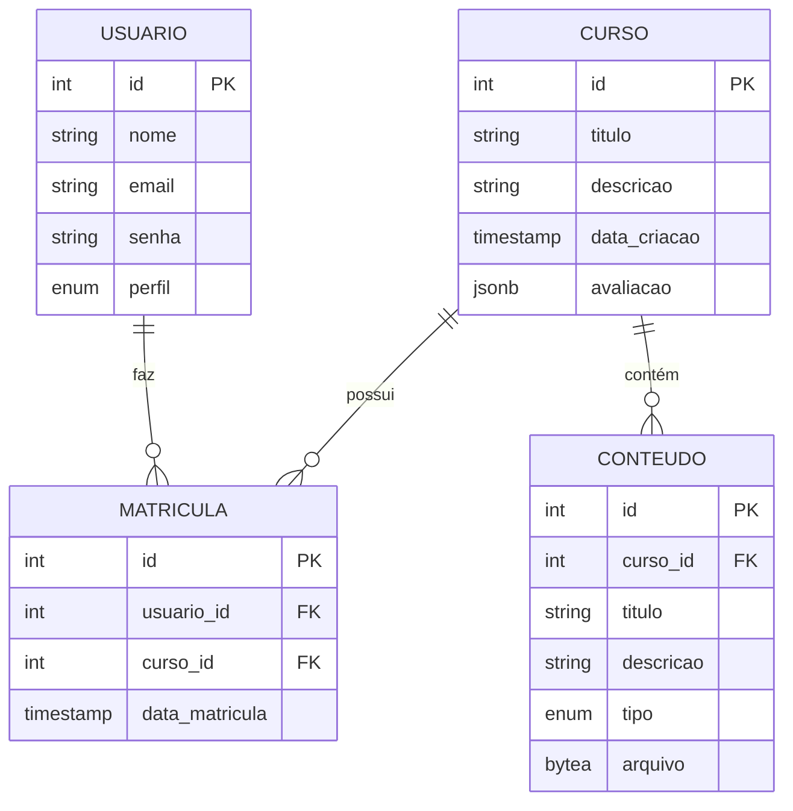

# README - Plataforma EduLivre 📘

## 📌 Visão Geral
Sistema completo de gerenciamento de cursos online com:
- 📚 Gestão de cursos e conteúdos
- ⭐ Sistema de avaliações com comentários
- 📊 Relatórios de desempenho

## 🛠 Tecnologias Utilizadas
| Tecnologia | Versão | Uso |
|------------|--------|-----|
| Java | 17 | Lógica de negócios |
| PostgreSQL | 15 | Banco de dados |
| JDBC | 42.7.7 | Conexão com BD |
| Maven | 3.6+ | Gerenciamento de dependências |

## 🚀 Configuração Rápida

### Pré-requisitos
- Java JDK 17+
- PostgreSQL 15+
- Maven 3.6+

### Passo a Passo
1. **Banco de Dados**:
   ```bash
   psql -U postgres -f edulivre.sql
   ```

2. **Configuração**:
   Edite `ConexaoPostgreSql.java`:
   ```java
   this.host = "localhost";
   this.username = "seu_usuario";
   this.password = "sua_senha";
   ```

3. **Execução**:
   ```bash
   Run Main.java
   ```

## 🗃 Estrutura do Banco


## 💡 Funcionalidades Principais

### 1. Gestão de Cursos
```java
// Exemplo: Listar cursos com média
List<Curso> cursos = new CursoDAO().listarCursosComMediaAvaliacao();
```

### 2. Sistema de Avaliações
```java
// Adicionar nova avaliação
ComentarioAvaliacao comentario = new ComentarioAvaliacao(
    123, // ID usuário
    5,   // Nota (1-5)
    "Excelente didática!" 
);
new MatriculaDAO().adicionarComentarioAvaliacao(1, comentario);
```

### 3. Operações CRUD
| Entidade | Inserir | Atualizar | Consultar |
|----------|---------|-----------|-----------|
| Usuário | `UsuarioDAO.adicionar()` | *Implementar* | *Implementar* |
| Curso | `CursoDAO.adicionar()` | *Implementar* | `listarCursosComMediaAvaliacao()` |
| Conteúdo | `ConteudoDAO.adicionar()` | *Implementar* | `buscarConteudosPorCurso()` |


---